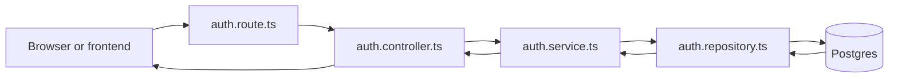
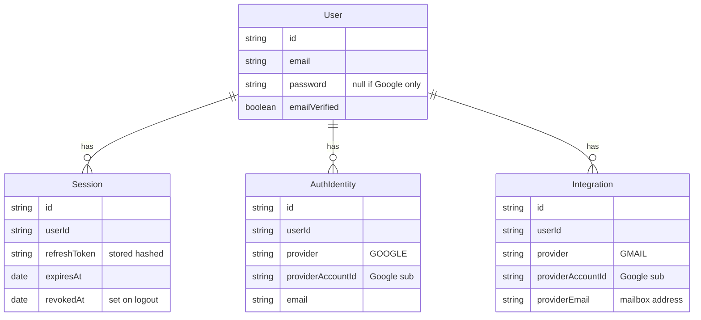
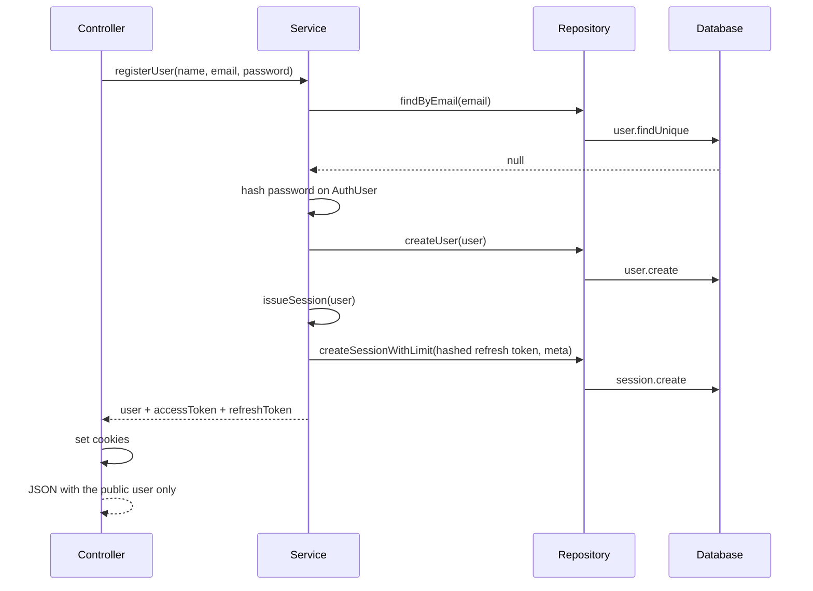
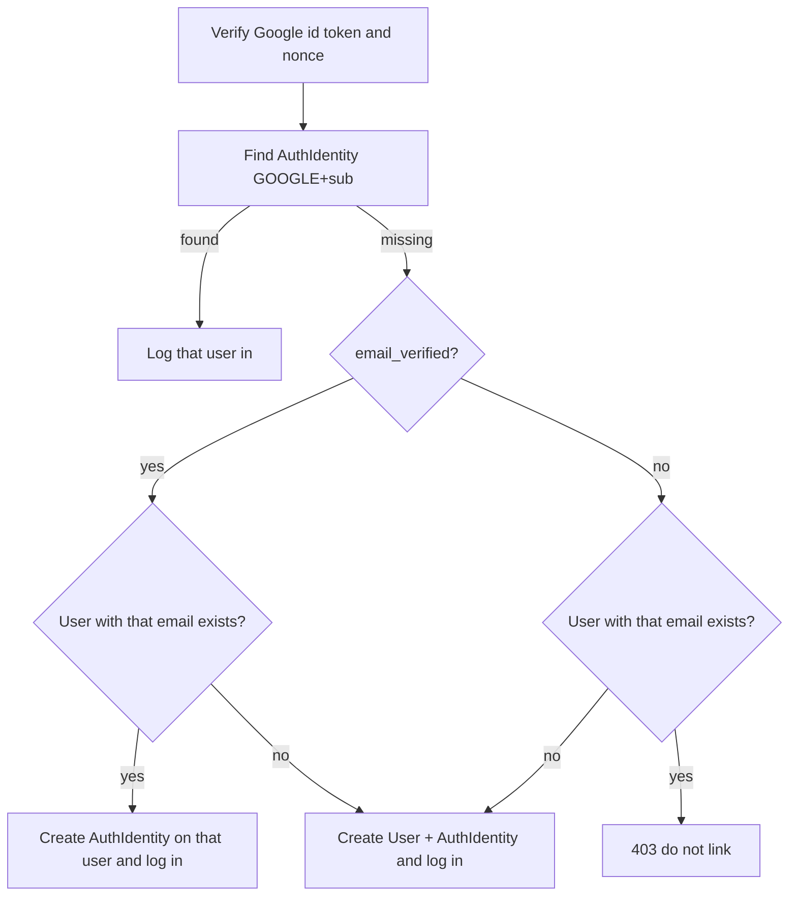

# How auth works

Read this when you need to change auth or copy the same shape into a new module. You do not need to memorize the files. Follow one request from the route to the database.

## The one idea

A request moves in one direction:

```text
Route  ->  Controller  ->  Service  ->  Repository  ->  Database
```

The answer moves back the same way.



Each box has one job. If you put the job in the wrong box, the next feature feels confusing.

| File | Job | What it must not do |
|---|---|---|
| `auth.route.ts` | URL + which function runs | No business rules, no Prisma |
| `auth.controller.ts` | Read the HTTP request, set cookies, send JSON | No "does this user exist?" decisions |
| `auth.service.ts` | The rules | No `req`, `res`, or `prisma` |
| `auth.repository.ts` | Read and write the database | No "if email exists, throw 409" |
| `auth.interface.ts` | The shapes and the method list | No running code |
| `auth.types.ts` | The `AuthUser` class, because it has behavior | Not a place for every interface |
| `auth.schema.ts` | Check the request body with Zod | Not the database shape |
| `provider/google/` | Talk to Google | Not the user/session rules |

`auth.route.ts` wires them together:

```text
repository = new AuthRepository()
service    = new AuthService(repository)
controller = new AuthController(service)
```

The service receives the repository. It does not create Prisma itself. That is why the service can be understood without opening the database code.

## Two records, not two users



- `User` is the account. Email is unique.
- `Session` is "this browser is logged in." Logout sets `revokedAt`. It does not delete the user.
- `AuthIdentity` is "this Google login identity belongs to this user." Login never creates an Integration.
- `Integration` is a connected mailbox (Gmail now). Created only via Connect Gmail while logged in. A user may have many.

Rules already stored in Prisma:

- One email, one user.
- One Google login identity, one user (`AuthIdentity` provider + providerAccountId).
- One mailbox, one user (`Integration` provider + providerEmail / providerAccountId).

Password login and Google login are two doors into the same `User`. Connect Gmail is a separate flow under `/api/v1/integrations`.

## What each interface is for

You do not create a new interface for every function. You create a shape when data crosses a boundary.

| Name | Why it exists |
|---|---|
| `RegisterUserDTO` | Body of email signup: name, email, password |
| `LoginUser` | Body of email login. This one comes from Zod: `z.infer<typeof loginUser>` |
| `AuthResposeDTO` | User fields the browser is allowed to see. No password |
| `AuthResult` | Public user + access token + refresh token. The controller puts the tokens in cookies |
| `Session` | What we insert into the `Session` table |
| `AuthIdentity` / `AuthIdentityInput` | Google login identity row (not a mailbox) |
| `GoogleAuthInput` | Google id_token after the login code exchange |
| `IAuthRepository` | Every database method the auth service is allowed to call |
| `IAuthService` | Every auth use-case the controller is allowed to call |

Mailbox types live in `src/modules/integrations/integration.interface.ts`.

`IAuthRepository` is a promise list, not a database. If the service calls a method that is not on this list, TypeScript stops you. That is the point of the interface.

`AuthUser` stays a class in `auth.types.ts` because it can hash and compare a password. An interface cannot do that.

## Email signup, one request

`POST /api/v1/auth/signup`



The service decides "already exists -> 409". The repository only returns the row or `null`.

`issueSession` is private. Signup, password login, and Google login all call it. It does five things:

1. Build the public user (`AuthResposeDTO`).
2. Create a random refresh token, store only the hash.
3. Enforce a max of **5 active sessions** per user (`revokedAt` null and not expired). If already at the cap, soft-revoke the LRU session(s) by oldest `lastUsedAt` (fallback `createdAt`), then create the new row.
4. Create a `Session` row with `ipAddress`, `userAgent`, and `lastUsedAt`, keep its id.
5. Sign an access token that contains the user id (`sub`) and the session id (`sid`).

The controller extracts `ipAddress` and `userAgent` from the request and passes them as `SessionMeta`. `lastUsedAt` is updated when tokens are rotated on refresh (not on every protected request). Protected routes use `authorize(...roles)` middleware, which verifies the access token and sets `req.user`.

Access token cookie: 15 minutes. Refresh token cookie: 30 days. The browser sends them back automatically. The JSON body does not include the tokens.

## Email login and logout

Login is the same picture, with a different rule in the service:

1. Find the user by email. Missing user -> 404 "Invalid credential".
2. Compare the password. Wrong password, or `password` is `null` -> same 404.
3. Call `issueSession`.

A person who signed up only with Google has `password: null`. Password login fails for them until a "set password" feature exists. That is intentional.

Logout:

1. Controller reads the `token` cookie.
2. Service verifies the JWT and reads `sid`.
3. Repository sets `revokedAt` on that session.
4. Controller clears both cookies.

## Google login vs Gmail integration

These are two separate flows with two redirect URIs.

| Flow | Routes | Creates |
|---|---|---|
| Login with Google | `/api/v1/auth/google/auth` + `/callback` | `User` / `AuthIdentity` only. Scopes: openid, email, profile |
| Connect Gmail | `/api/v1/integrations/gmail/connect` + `/callback` | `Integration` (mailbox tokens + watch). Requires logged-in session. Scope: `gmail.readonly` only |

### Login or signup with Google

`loginOrRegisterWithGoogle` is a decision list. Read it from top to bottom. The first match wins.



Login never creates or updates an `Integration` and never stores Gmail tokens.

`isNewUser` only changes the HTTP status: 201 for a new account, 200 for a login. The cookies are the same.

### Connect Gmail later

Mailbox connection lives in `src/modules/integrations/` (same route → controller → service → repository shape as auth). Provider code is under `provider/gmail/`. Outlook later adds `provider/outlook/` the same way.

- `userId` always comes from the `token` cookie (or Bearer header), never from query params.
- Connect uses a signed `state` (`STATE_SECRET`) plus PKCE in the session.
- A mailbox can belong to only one user; reconnect updates the same Integration row.
- List never returns tokens. Disconnect calls Gmail stop, clears tokens, sets status `DISCONNECTED`.

## Where a new feature goes

Use this order every time. Do not start by typing in the controller.

1. Write the rule in one sentence. Example: "A logged-in user can disconnect Gmail."
2. Decide the module: auth for identity/session, integrations for mailboxes.
3. Add the repository method only if you need a new query or write. Add that method to the module interface in the same edit.
4. Add the service method with the rules.
5. Add the controller method: read input, call the service, send status and JSON.
6. Add one line in that module's route file.

Outlook later: add `provider/outlook/` under integrations with the same four-file shape as gmail. Reuse `IntegrationRepository` methods that already take a provider.

## A blank you can fill in

Copy this before you write the feature. If a box is hard to fill, you do not understand the feature yet. That is the useful moment. Fill the box before opening the code.

```text
Feature name:

One sentence rule:

Who is allowed:

Route and HTTP method:

Input shape:

Database read:

Database write:

Conflicts, and which status code:

Response shape, with secrets removed:

Service method name:

Repository method name, or "reuse ____":
```

## How to read this code when your mind goes blank

Do not start at the top of `auth.service.ts`.

1. Open `auth.route.ts` and find the URL.
2. Open only that one controller function.
3. See which service method it calls.
4. Read only that service method. When it calls the repository, jump to that one repository method, then come back.
5. Ignore every other function until this request makes sense.

The private helpers are shared, so read them once:

- `issueSession` — make cookies data for any successful login.
- `verifyGoogleAccount` — trust Google, require a verified email, return `sub`, `email`, `name`.
- `toIntegrationInput` — turn those values into the database write shape.
- `setAuthCookies` / `clearAuthCookies` — HTTP only.
- `startGoogleOAuth` — save intent, then redirect.
- `readUserId` — "who is logged in?" from the access token. The user id is `payload.sub`.

## Words that keep showing up

| Word | Meaning in this app |
|---|---|
| DTO | A shape for data crossing a boundary. Request in, or response out |
| Interface | A list of fields or a list of methods. It does not run |
| `implements` | The class promises to have every method on the interface |
| `sub` | Google's permanent account id. Also the user id inside our access token |
| `sid` | Our session row id, inside the access token |
| upsert | Update the row if it exists, otherwise create it |
| transaction | Several writes that succeed together or not at all |
| intent | `login` or `link`, saved before Google redirects away |

## What success looks like

You can add a feature when you can say, before typing:

- which route receives it
- which service method owns the rule
- which repository method touches the table
- which existing shape you will reuse

If you can say those four things, the code is the small part.
